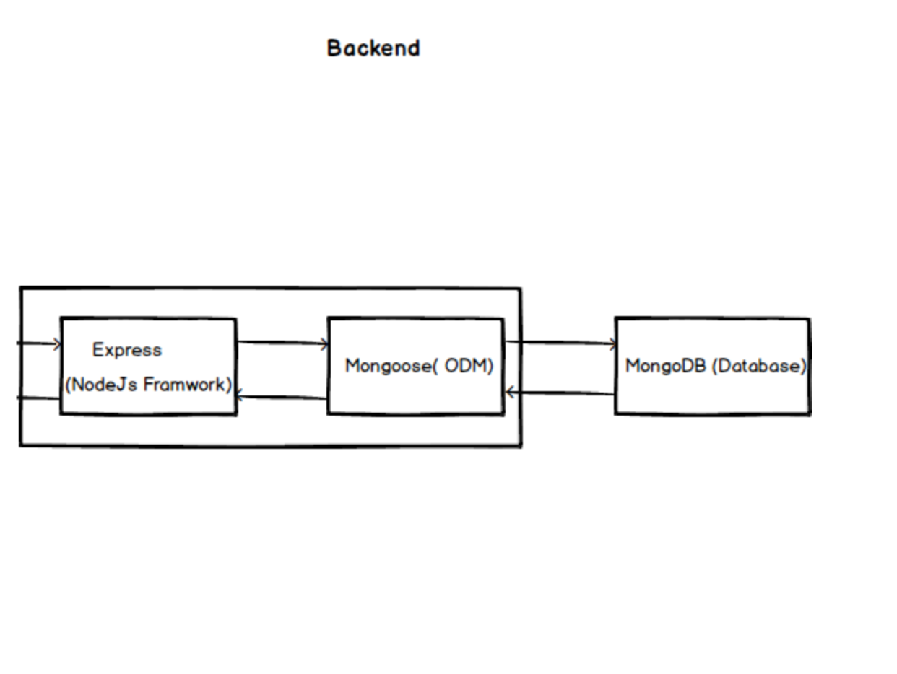

# url-shortener-backend
Url Shortener Backend

<h4 align="center">Creating custom URL shortener back-end With NodeJS, MongoDB</h4>
<div align="center">
  <sub>Built with ❤︎ </sub>
</div>

</br>
Building a custom URL shortening rest api using NodeJS, ExpressJS and MongoDB.

## Architecture Design


## Technologies

- ### Back end

  - [Express](https://expressjs.com/)- Nodejs framwork for building the REST Apis
  - [Mongodb](http://mongodb.com/)- Document oriented NoSQL database
  - [Mongoose](https://http://mongoosejs.com)- MongoDB object modeling tool
  - [Short-id](https://github.com/dylang/shortid)- Short id generator
  - [Valid-url](https://github.com/ogt/valid-url)- URI validation functions
  - [Nginx](https://www.nginx.com)- Nginx is event-based and asynchronous web server.


## Getting Started

#### Clone the project

```sh
# clone it
git clone https://github.com/rakeshkumargupta/url-shortener-backend.git
cd url-shortener-backend
# Make it your own
rm -rf .git && git init
```

#### Run back end

MongoDB must be installed on the machine and listening on default port (27017).

```
# Install dependencies
npm install
# Start  client
npm start
```

#### Run front end
Check out repository https://github.com/rakeshkumargupta/url-shortener-frontend for running React based front end web app.


## License 

GNU